[toc]

# 前言

## 学习网站

[人体肌肉 -人体肌肉图解-肌肉部位、人体肌肉解剖图_健身吧 (jianshen8.com)](https://www.jianshen8.com/zhuanti/jirou.html)

## 解剖学姿势

主要观察三个系统：

1. **-骨骼；**
2. **-关节**， 骨骼之间通过关节联结；
3. **-肌肉**， 肌肉收缩牵引骨骼产生关节的运动。

**解剖学姿势即：身体直立，双足并拢且平行，双臂下垂，掌心向前**。这并非我们日常的姿势，但在人体解剖学中，我们以这个姿势为基准来描述所有的运动。

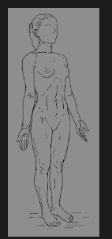

## 人体运动面

1. **矢状面**：y轴，沿人体正中垂直切开

   **人体运动发生在矢状面前叫屈，后叫伸**

2. **冠状面**：x轴，沿人体前后垂直切开

   **往人体正中靠近叫内收，反之外展**。这里颈部与躯干的运动叫侧屈

3. **水平面**：沿人体正中水平切开

   骨骼向外叫旋外，否则是旋内

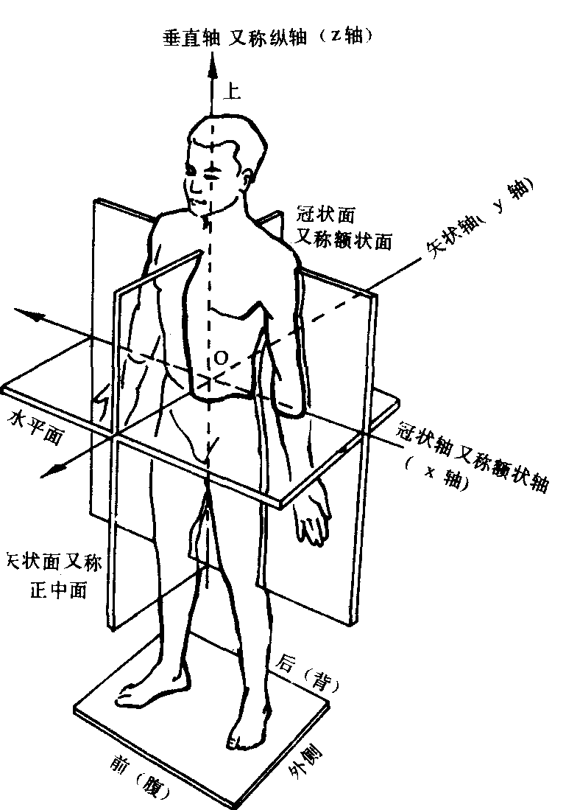

## 骨骼

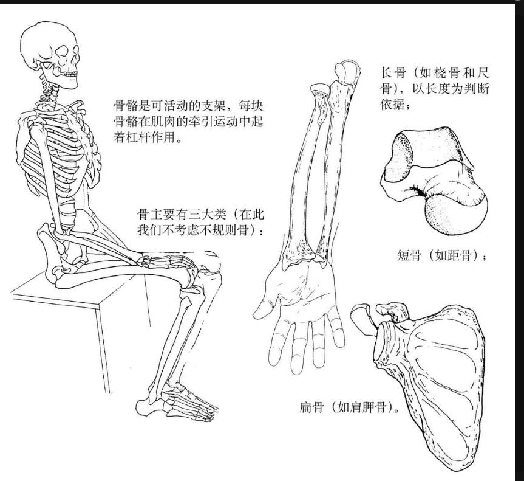

1. **长骨**

   **大拇指侧叫桡骨，小拇指叫尺骨。尺长桡短。内尺外绕（从解刨学姿势的内外）**

   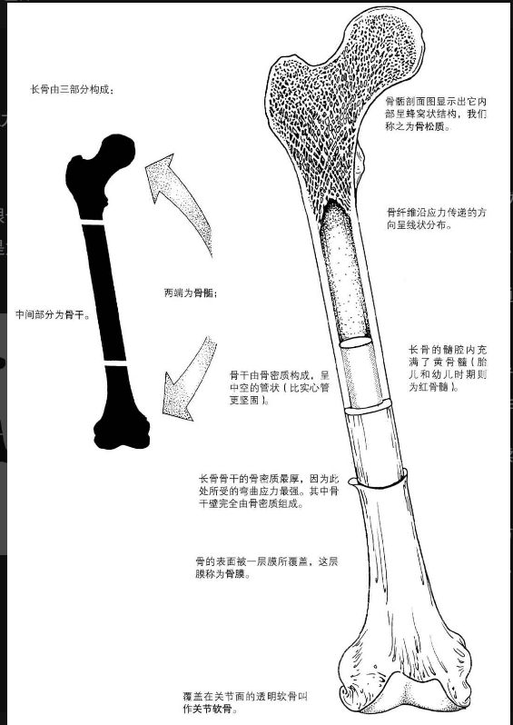

2. **短骨**

3. **扁骨**

## 关节

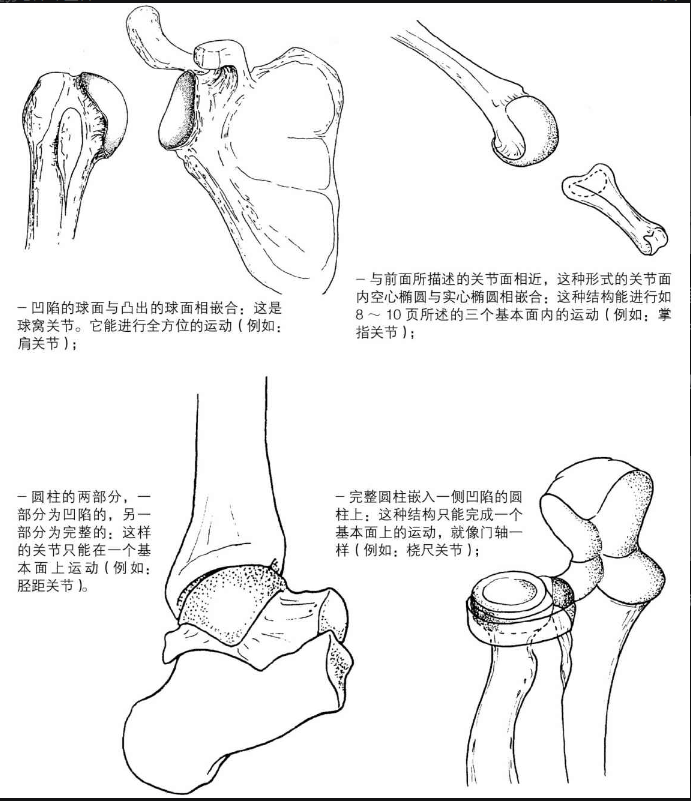

## 软骨

**软骨是骨面上覆盖着的光亮白色层**。软骨的成分与骨骼成分类似，但它的含水量更高，更具有弹性。**它的作用是保护所覆盖的骨骼。**

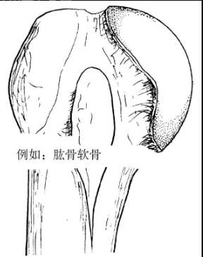

## 关节囊

包在关节周围支撑所有关节面的套状纤维层叫作**关节囊 （capsula articularis ）。它附在骨面及关节面的周围。**

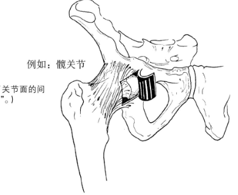

**关节囊内部附着一层膜**，这层膜有如大衣的衬里，我们称之为**滑膜** （membrana synovialis ）。滑膜贴附在关节囊的内层，并且在突入关节腔时形成皱襞。**滑膜主要功能：分泌滑液**（见左图阴影部分），滑液充满关节腔。**滑液有两种作用：润滑关节面，提高关节灵活性；同时它也为软骨提供养分。**

## 韧带

**韧带为带状的结缔组织，其作用主要是连接相邻的两块骨骼**。通常情况下，韧带既可位于关节囊内部，也可位于关节囊外部，位于关节囊外的韧带有时为关节囊局部纤维的增厚。

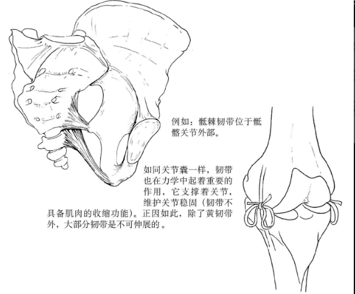

## 肌肉

### 重点肌肉

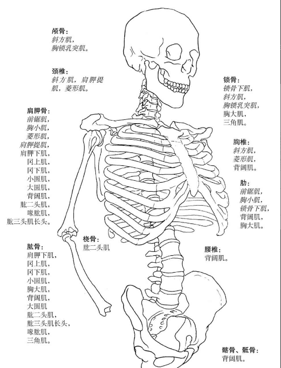

### 肌肉组成

身体的运动是由肌肉收缩引起的。我们这里将要研究的肌肉是**横纹肌或者随意肌**

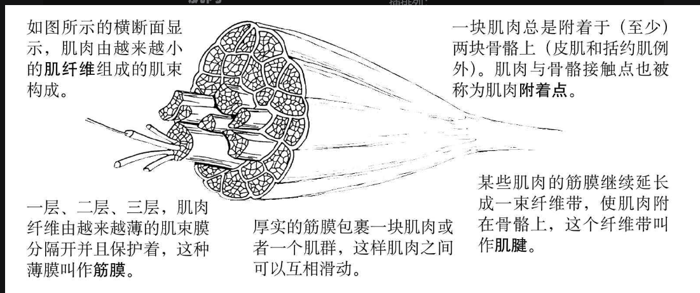

- 开链与闭链

  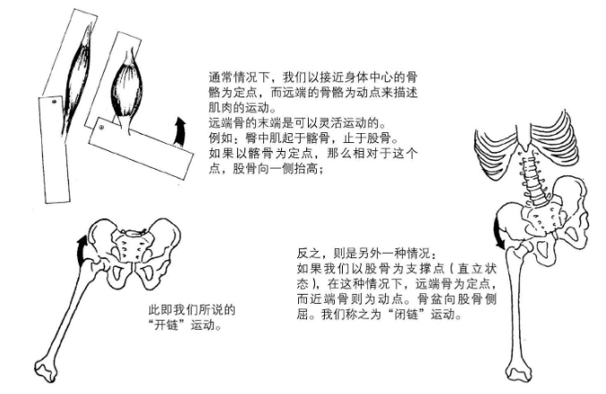

### 肌肉的弹性

**肌肉除了可以收缩（主动）之外，还具有弹性（被动）**。也就是说在一定的限度内，通过拉长肌肉各附着点之间的距离，我们可以拉伸肌肉。拉伸肌肉时的运动方向与肌肉本身的运动方向相反。

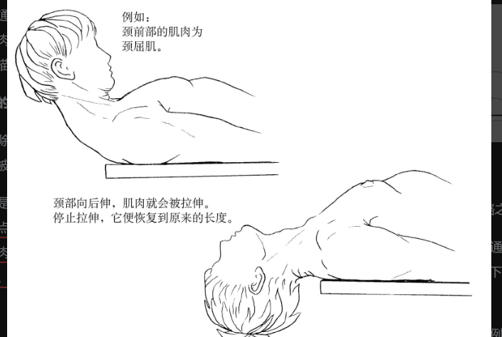

### 肌肉的形态

- **一块肌肉可以有多个肌体，我们称之为头。如二头肌（两个头**，见第四章“肱二头肌”）、**三头肌（三个头**，见第四章“肱三头肌”）、**四头肌（四个头：[股直肌](https://www.yixue.com/index.php?title=股直肌&action=edit&redlink=1)、股中肌、[股外肌](https://www.yixue.com/index.php?title=股外肌&action=edit&redlink=1)和[股内肌](https://www.yixue.com/index.php?title=股内肌&action=edit&redlink=1)**，见第六章“股四头肌”）。通常情况下，**肌肉近端的附着点叫起点，远端附着点叫止点。**

- 肌肉只**跨越一个关节**时，我们称之为**单关节肌 。它的收缩只使一个关节运动。**

- 当肌肉**跨越多个关节时，我们称之为多关节肌 。它的收缩可使多个关节运动**。为了拉伸这种肌肉，我们必须同时在多个关节上做跟肌肉本身运动方向相反的运动。

  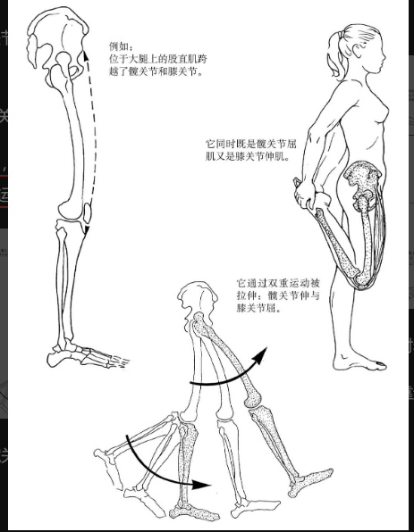

### 肌肉收缩的形式

1. 如果运动是通过正在收缩的肌肉来完成的，这种肌肉的收缩叫**向心收缩** 。此时各肌肉附着点之间的距离缩小。
2. 当运动是通过对抗它的肌肉作用而减慢时，该肌肉的收缩叫**离心收缩** 。此时肌肉各附着点的距离变远。
3. 当肌肉保持收缩以维持某种姿势，我们称这种收缩为**静力收缩** 。此时肌肉的附着点不发生移位。

# 躯干

## 躯干的整体运动

1. **屈**
2. **伸**
3. **侧屈**
4. **回旋**

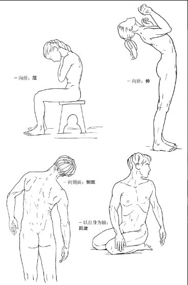

## 脊柱

### 脊柱区域划分

命名规则：

1. **C：颈椎，7个**
2. **D或T：胸椎，12个**
3. **L：腰椎，5个**
4. **S：骶椎，1个**

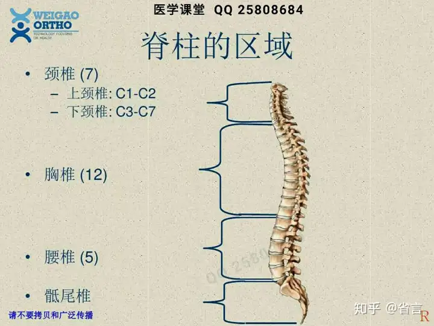

### 脊柱生理曲线

**颈凸，胸凹，腰凸，骶凹**

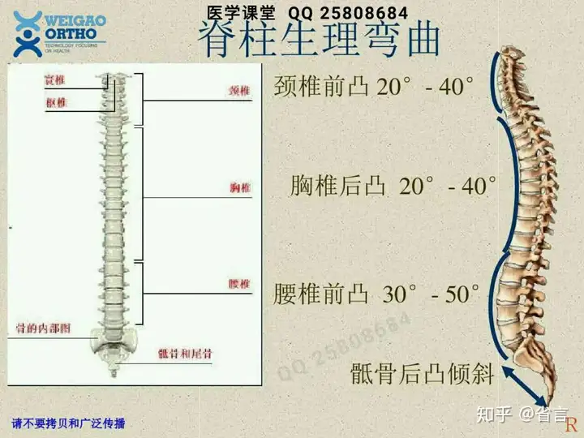

### 脊柱结构

**前半部分叫椎体，后半部分叫椎弓**

要知道：椎体，横突，棘突

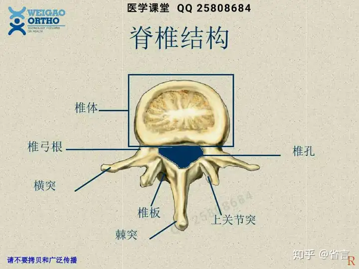

**椎间盘组成：**

1. -纤维环 ，数层呈同心圆状排列的纤维环构成的软骨层，纤维环的排列形状犹如洋葱片；

   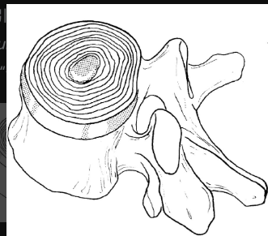

2. -中心部分为**髓核** ，这是**含水最多的区域，由胶状黏液构成**。

   椎间盘突出，也称为椎间盘脱出或椎间盘疝，是脊柱的一种常见疾病，它主要是**由于椎间盘内部的髓核通过纤维环的裂缝向外突出，可能压迫到附近的神经根或脊髓，导致疼痛和神经功能障碍**

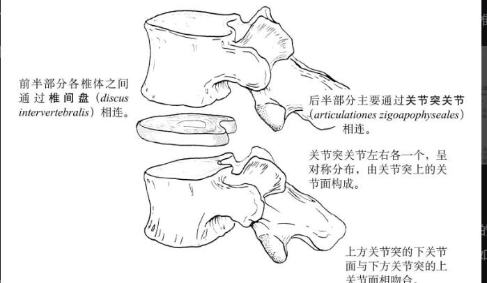

### 脊柱韧带

1. 前纵韧带
2. 棘上韧带
3. 后纵韧带：脊柱前驱时承受腰间盘的推力

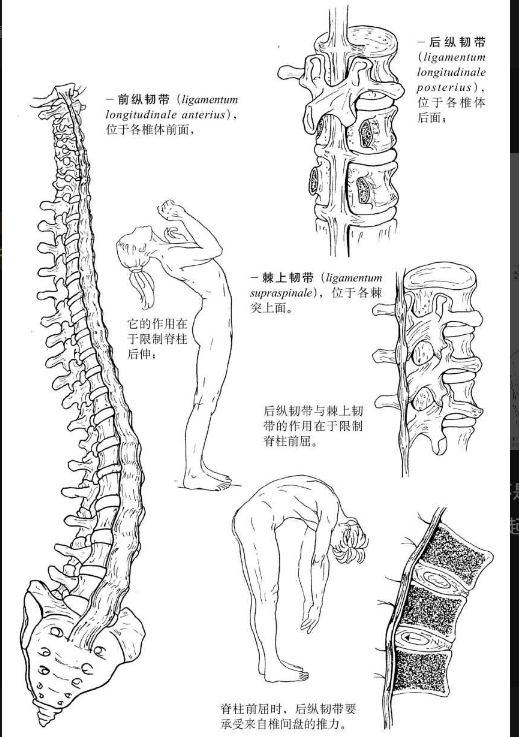

### 脊柱颈段

> **C1、C2 上颈段  
> C3-C7 下颈段**

#### 基本构成

1. **上颈段|颈椎枕下端：**它是脊柱颈段位置最高的部分。此部位可进行**头部的独立运动，比如轻微的点头和摇头动作。**

1. **下颈段**：颈椎下段的**屈、伸和回旋的运动幅度较大，但是侧屈的运动幅度则较小**。

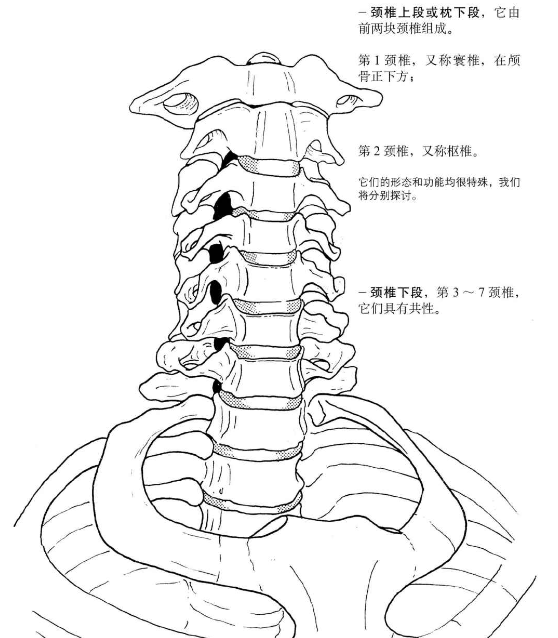

#### 寰椎C1

它是位于脊椎最上方的第一块椎骨。由两个侧块（massa lateralis atlantis ）组成。

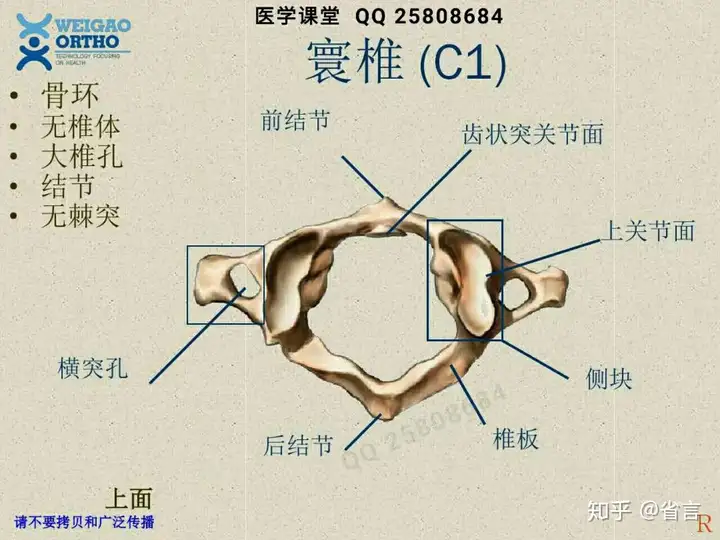

#### 枕骨

位于颅骨底部后方

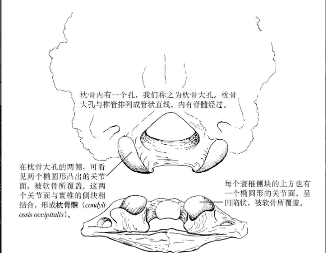

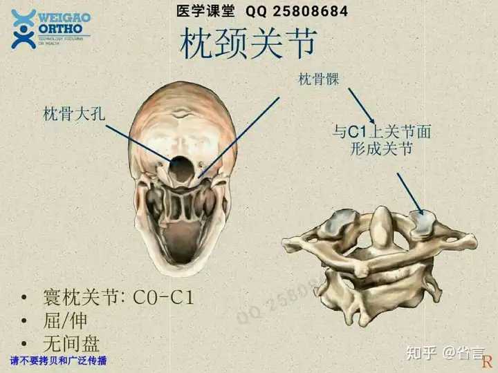

#### 枢椎C2

寰椎与枢椎之间没有椎间盘，只有两个常规的关节。与枢椎相同，寰椎上的关节面也是凸出的：它们相互之间不嵌套，为永久性的动关节。

如此一来，**寰椎以枢椎为支撑并以它为轴转动：此处回旋幅度最大（摇头动作）。**

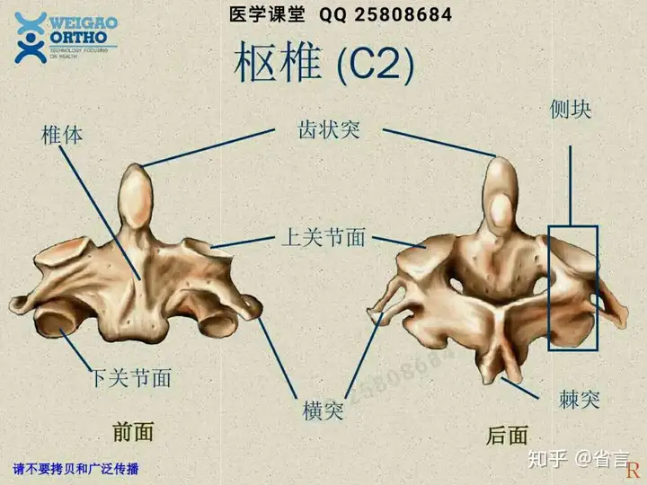

#### 下颈段

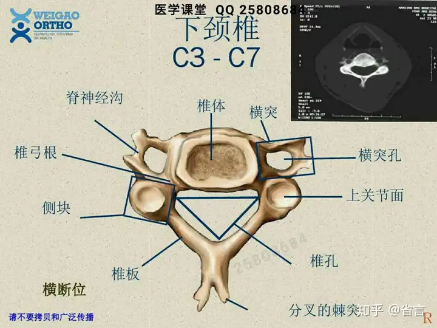

### 脊柱胸段

#### 基本构成

> **T1-T12**

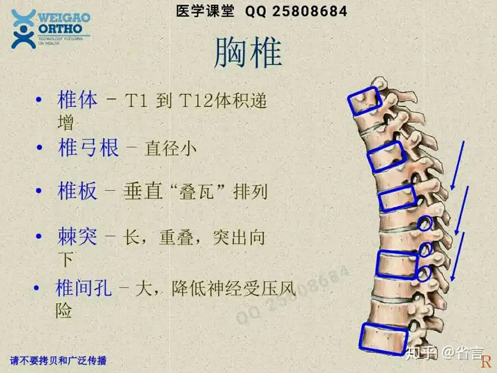

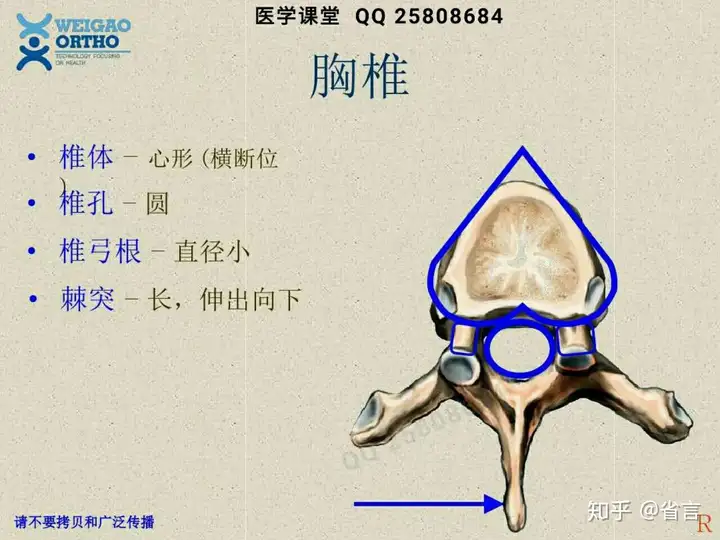

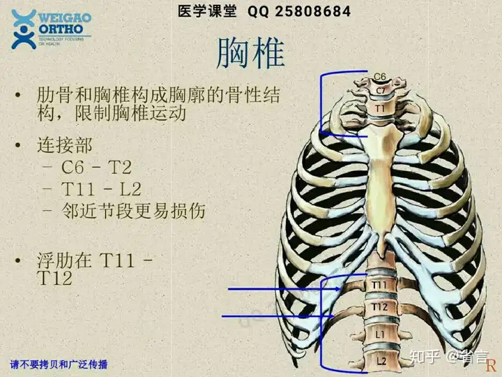

#### 运动表现

胸椎可完成所有种类的运动，但**由于胸廓与椎骨相连，这很大程度上限制了胸椎的运动幅度。**

1. 第**1～7胸椎（位于两肩胛骨之间的区域）运动受限尤其明显**，肋骨通过其前端很短的肋软骨几乎直接与胸骨连接。
2. 第**8～10胸椎支撑着“假肋**”，其前部具备更大的自由度。它们借助一块略长的与第7肋软骨相连接的软骨与胸骨相连。这使得它们所受的限制得以减轻。
3. 最后是第**11～12胸椎**，它们支撑着“浮肋”，不与胸骨相连接。此处是**具有高度运动性的交接部位**。

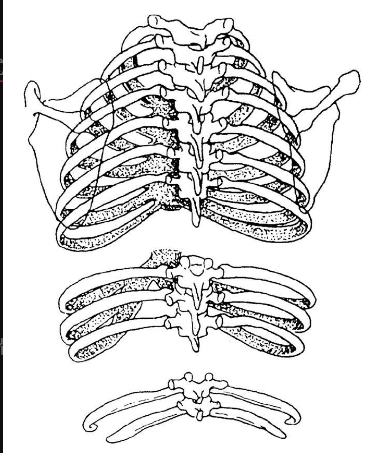

#### 胸廓

它**由位于后部的胸椎、侧面的肋骨以及前部的胸骨组成。**

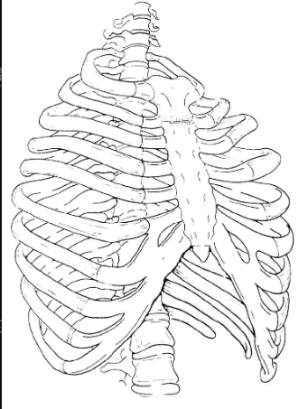

#### 胸骨

胸骨为扁骨，位于胸廓前部，由3部分组成：

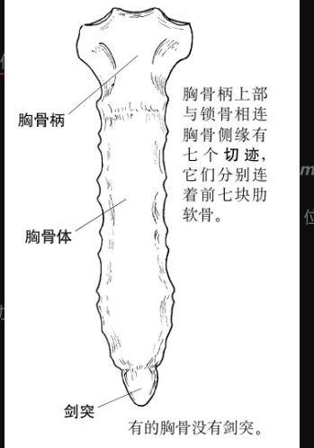

#### 肋骨

肋骨为细长的弓状扁骨。这种形状使得它具备完成呼吸运动所需的伸缩性。每根肋骨包含以下部分：

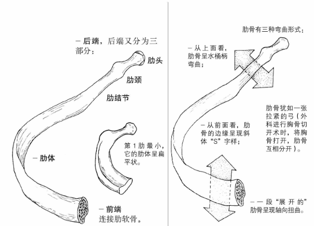

每块肋骨通过三个点与两块椎骨相连接：肋头上的两个关节面与椎体上的1个关节面相对应，肋结节上的1个关节面与胸椎横突相对应

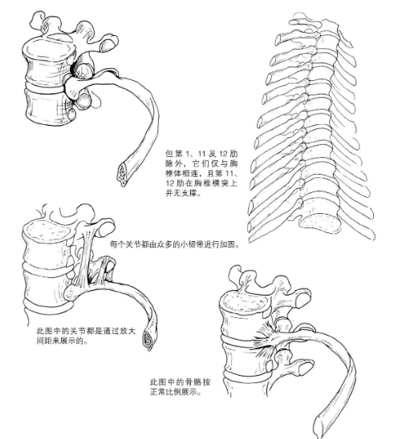

胸廓的前部，每块肋骨通过肋软骨 （cartilago costalis ）与胸骨相连。这样的结构增强了胸廓的弹性。

1. 前7对肋软骨较短，直接连接于胸骨上，称为“真肋区 ”。
2. 第8～10肋的软骨较长，肋骨通过肋软骨连到第7肋上，因此为“假肋区 ”，其运动性较强。
3. 第11、12肋没有软骨，我们称之为“浮肋 ”

### 脊柱腰段

> **L1-L5**

脊柱位于腰部那段介于骨盆与胸廓之间的椎骨，紧连骶骨，**向后凹陷（前凸）**。

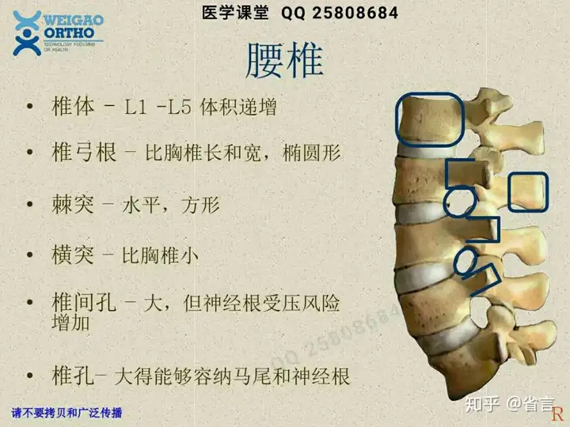

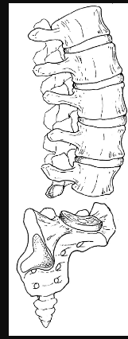

## 骨盆

### 组成

骨盆是个环状骨质结构。它主要由三部分构成：位于**后部的骶骨 、左右两块髋骨和后部下面的尾骨。**

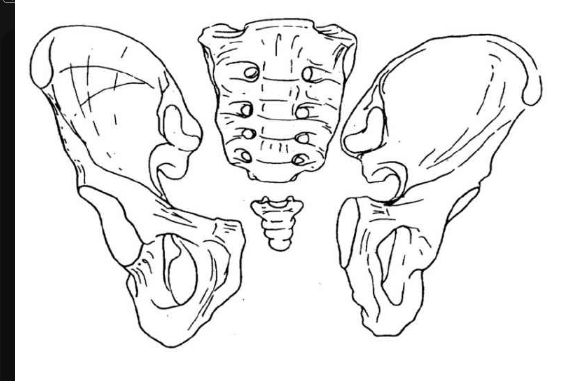

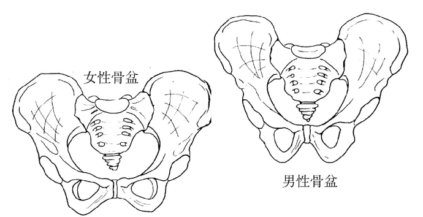

### 髋骨

左侧髋骨图：

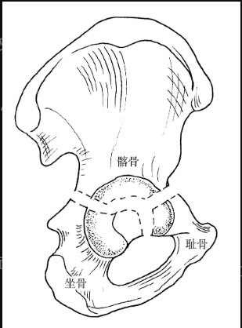

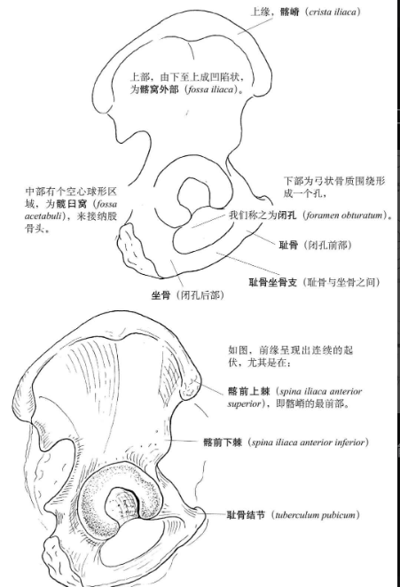

### 骶骨

骶骨位于骨盆后部**正中央，即两块髋骨之间**。它呈**倒三角形，由五块椎骨**合并而成。

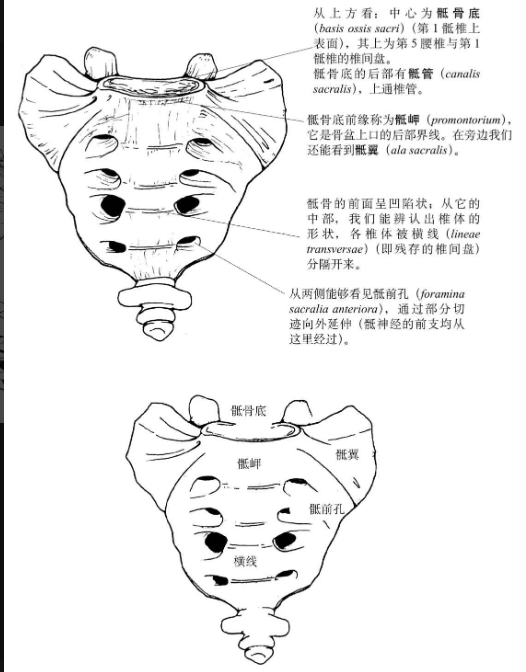

### 尾骨

**尾骨是个三角形的小骨，由3～5块尾椎融合而成**，但是我们已经不能清晰地分辨出每块尾椎。

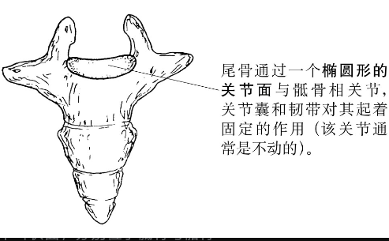

## 人体躯干各骨骼所附的肌肉

### 躯干与颈后部的肌肉

#### 多裂肌

**位于椎骨后面，分布于骶骨与枢椎之间。每一段均分为四束，起于横突**：

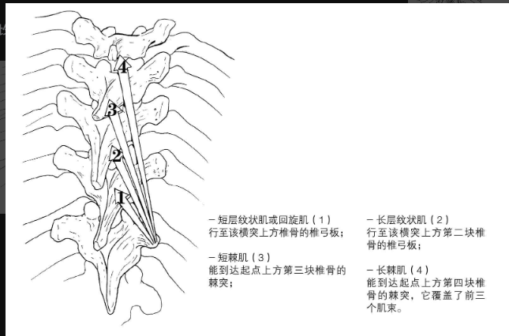

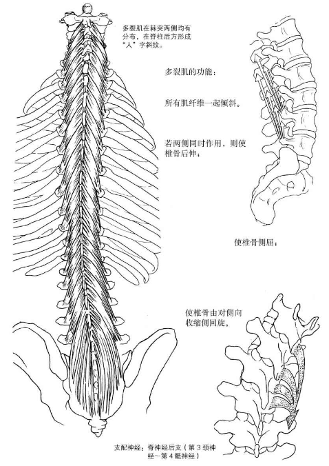

#### 枕下肌和头上斜肌

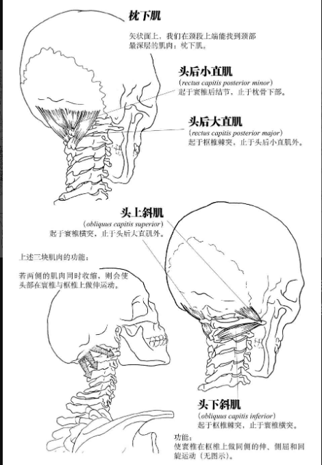

#### 长肌与髂肋肌

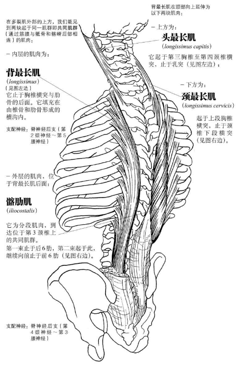

#### 棘肌和头半棘肌

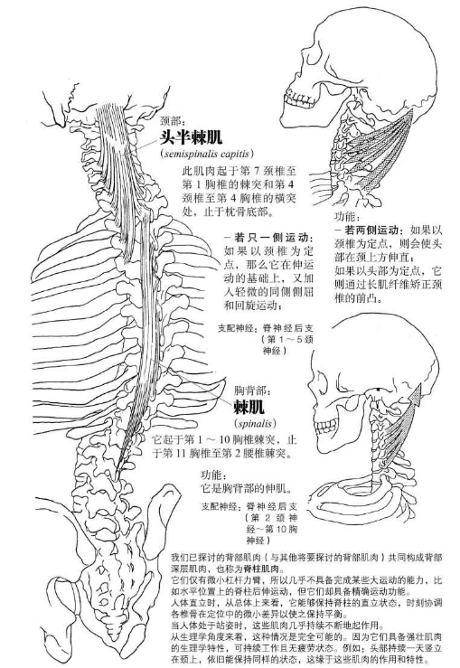

#### 夹肌和肩胛提肌（重点）

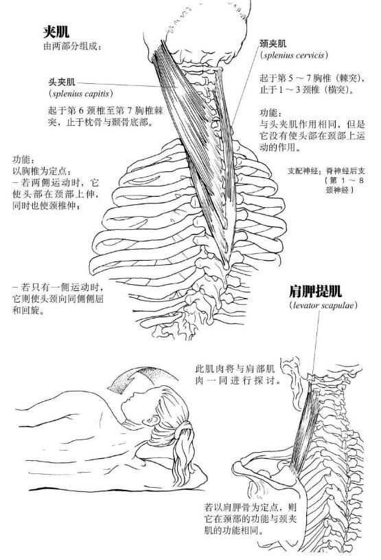

#### 背阔菱形后锯肌（重点）

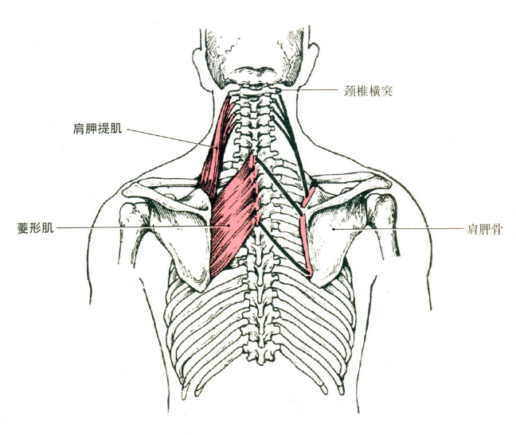

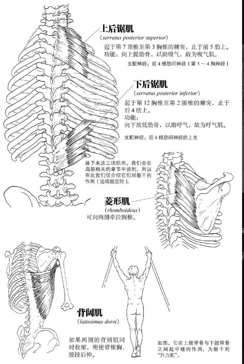

#### 斜方肌

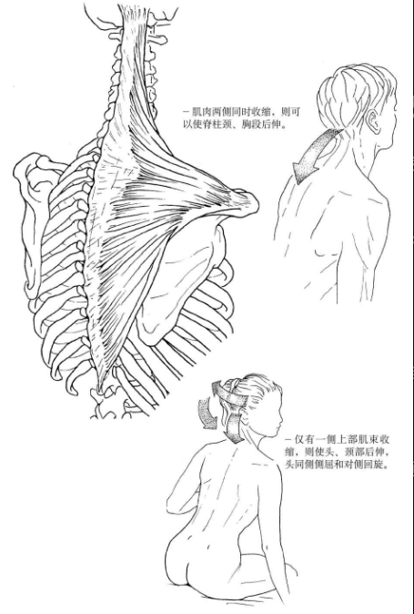

### 颈前面及侧面的肌肉

#### 颈长肌

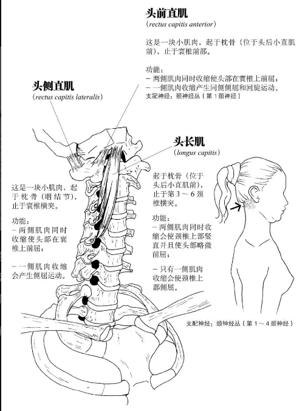

#### 斜角肌

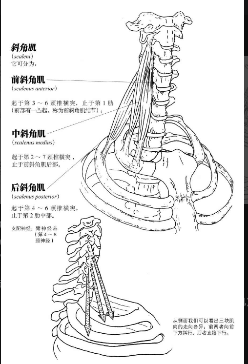

#### 胸锁乳突肌

这块肌肉将颅骨与锁骨、胸骨连接起来。

### 胸肌

#### 膈

为扁薄阔肌，呈轮辐状，位于胸廓内部。它向上汇集成一个穹形屋顶，位于胸、腹腔之间。

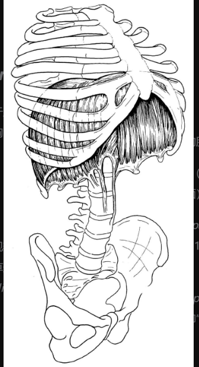

### 腰椎两侧肌肉

#### 腰大肌

-两侧作用 ：由于它的肌纤维是**向前下方斜行，故长久以来腰大肌的作用被描述为使腰椎前凸。**

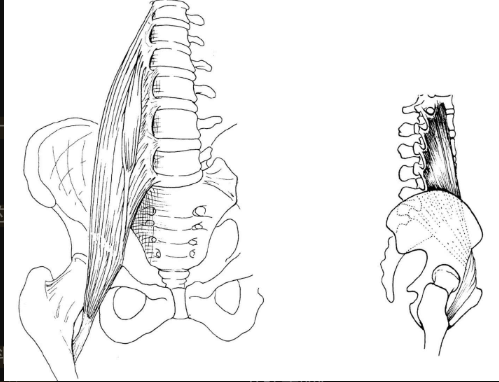

-单侧作用：如果仅一侧肌肉收缩，腰大肌则会引起**腰椎侧屈、前屈和对侧向同侧的回旋。**

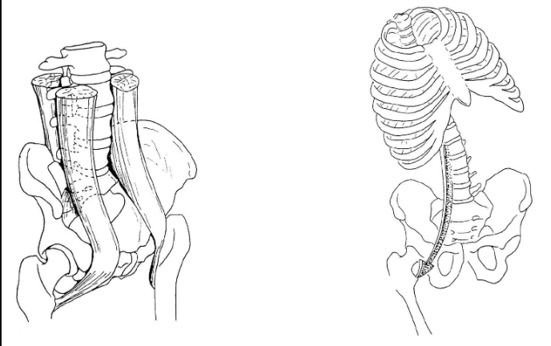

#### 腰方肌

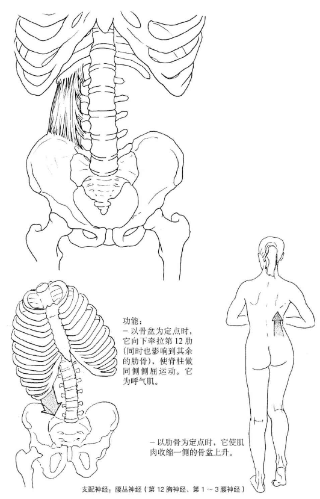

### 腹肌

#### 腹横肌

腹横肌为最深层肌。

功能：肌纤维呈环状，在收缩过程中使得腹部的直径变小。若椎骨固定，腹横肌收缩则引起收腹运动。若以腹前筋膜为定点，则会引起腰椎前凸。

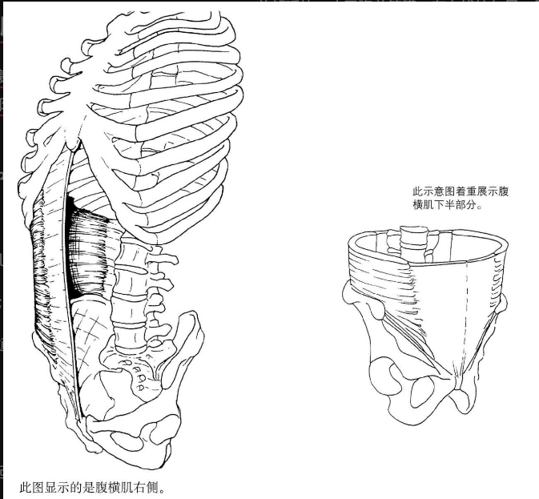

#### 腹内斜肌

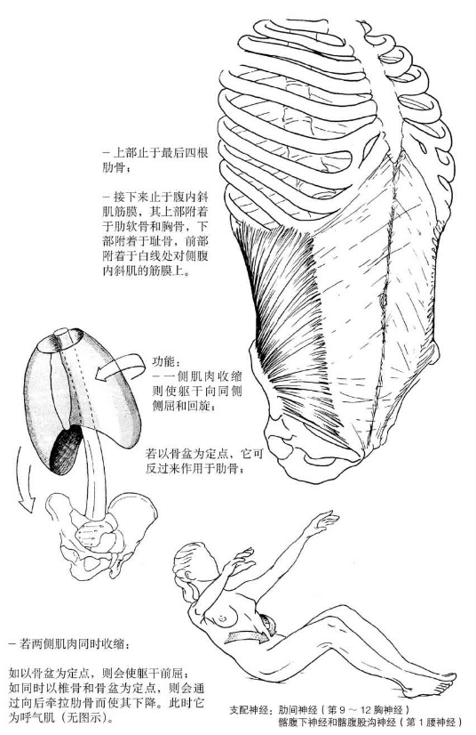

#### 腹外斜肌

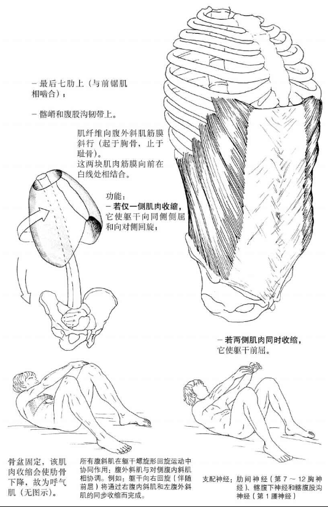

#### 腹直肌

功能：它使胸骨接近耻骨。因此它是躯干部最重要的屈肌。同样，它也能使耻骨靠近胸骨，引起骨盆后倾（无图示）。

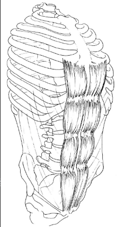

#### 提肛肌

内部

肛提肌位于小骨盆内，起于耻骨与坐骨棘之间的肛提肌腱弓，途经闭孔。它在肛门前、后的正中线上与对侧的肛提肌纤维相连，止于尾骨与骶骨的边缘（下部）。

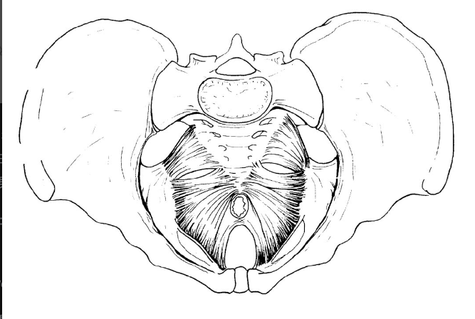

#### 尾骨肌

外部

它起于坐骨棘，止于骶骨与尾骨。

功能：它除了能节制大小便之外，还起到支撑小骨盆内脏器官的作用。它还能引起骶骨的反转运动。

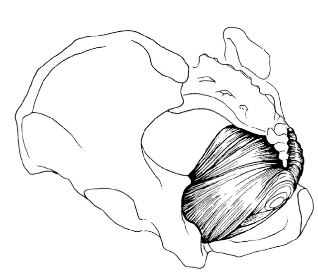

#### 腹壁

由所有限定腹腔内脏位置的结构所构成的整体：

1. -上部：膈、末端肋骨和肋软骨、胸骨；
2. -后部：腰椎；
3. -前部：腹肌；
4. -下部：骨盆和盆膈。

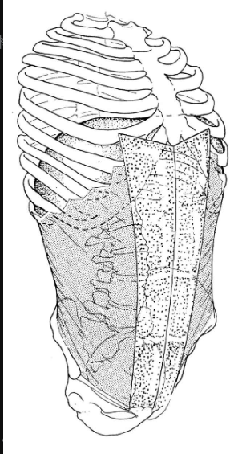

#### 呼吸运动中的膈与腹肌

躯干有两大部分：胸部与腹部。从力学角度上看，两者是完全不同的：

1. -**腹部**可比作一个**可变形而不可压缩的液体箱；**
2. -**胸部**可比作一个**可变形且可压缩的充气箱。**

**膈犹如一个气门，在两个箱之间移动，它的运动通常与腹肌运动相结合**。这些肌肉在多种运动中促成了压力变化以及胸、腹壁的形变，比如呼吸、发声、喊叫、咳嗽、排便、分娩和打嗝。

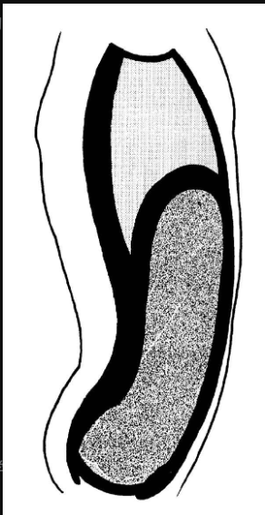

#### 膈与腹肌如何参与呼吸运动

1. **吸气时：此时膈收缩引起中心腱下降，从而使胸廓体积垂直增大**。肺将通过中间媒介胸膜感应到这种变化。此时肺内会产生负压及对空气更多的需求，从而引起吸气。我们日常所进行的呼吸均如此形成，并且基本都是由膈来完成的。

   但是中心腱的下降会受到多种力量阻止。此时，中心腱成为定点，膈则通过以下方式成为肋提肌：-通过向上（向内）斜行的肌纤维，-间接通过腹部的推力使其纵向压缩，横向变形。

   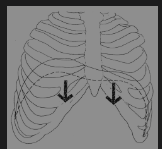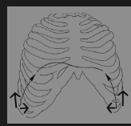

2. **呼气时：静态呼气通过肺部组织的弹性回缩而实现**，该组织在吸气时被拉伸。肺的“回缩”产生肺内压，肺里空气呼出，但并未彻底将其排空。

   **深呼气（也称为“强制呼气”）**是呼气肌作用的结果，尤其是腹肌，它们有两种运动方式：-向高处、向胸廓方向推动腹部；-拉低胸廓。在它们的作用下，肺内压增大。增大的肺内压使肺内更多的空气被排出。然而**无论深呼气的力量有多大，总是有一定体积的空气永久存留在肺内，这称为残气量。**

# 肩部

## 基本

肩部并不单单指的是肩关节，如同髋部一样，它是一个解剖学与功能学意义上的整体，连接着上肢与胸廓。

这个整体应当具备双重功能：

1. -**使上臂有很大的运动幅度**。上臂的肘关节与腕关节也具有运动性，这就使手部能够在远端围绕躯干运动。
2. -**保证良好的稳固性**，以便在上肢需要力量的情况下（有力的抓取动作、重物搬运、手部支撑等）能提供支持。

关于肩关节，我们最常听说的是连接肱骨与肩胛骨 的关节。但是肩胛骨本身如同一个可转向的平台，它通过锁骨与胸廓相连。因此这里就出现了两个附加的关节：

1. -**肩锁关节，位于肩胛骨与锁骨**之间；

2. **-胸锁关节，位于胸骨与锁骨**之间。

   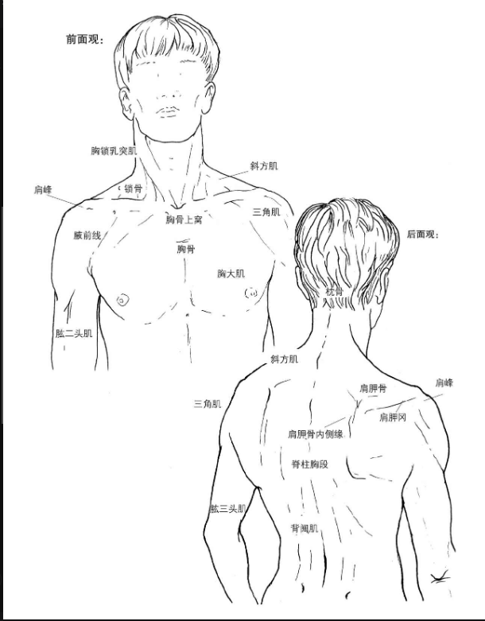

   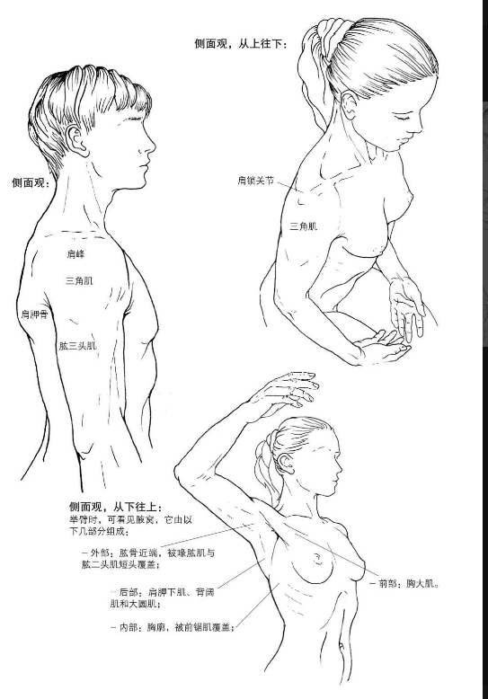

## 肩部运动

1. 首先肩关节在胸廓上的运动：

   - **肩关节：上提下仰外展内收**
   - **肩胛骨：旋内旋外，上仰下提**

   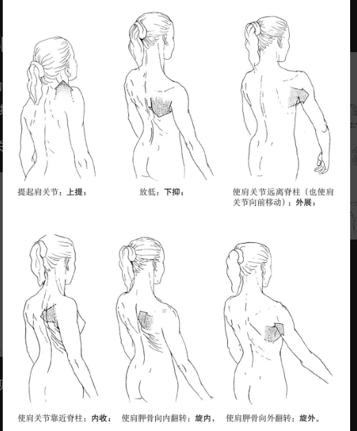

   > 所以对于卧推动作：**重点在于强调整个动作过程中肩关节保持下沉。同时稍微的后缩肩胛骨，但不是积极主动地挤压在一起。**

2. 上臂相对于肩胛骨的肩部运动。

   屈、伸、外展、内收、旋内旋外

   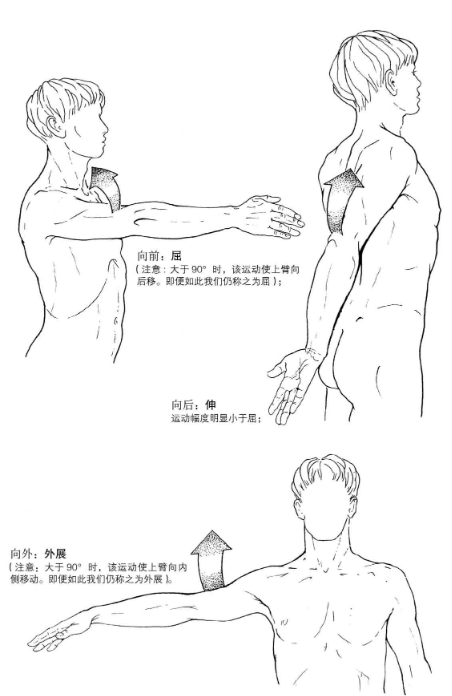

   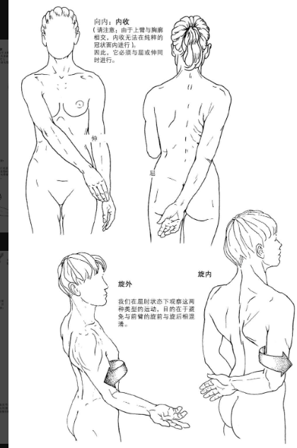

## 上肢带

上肢带由后部的肩胛骨、前部的锁骨以及正前方的胸骨组成。

## 锁骨

为圆柱形短骨，位于胸骨和肩胛骨之间，犹如拱形支架。从上方看，它呈现出斜体“S”形。

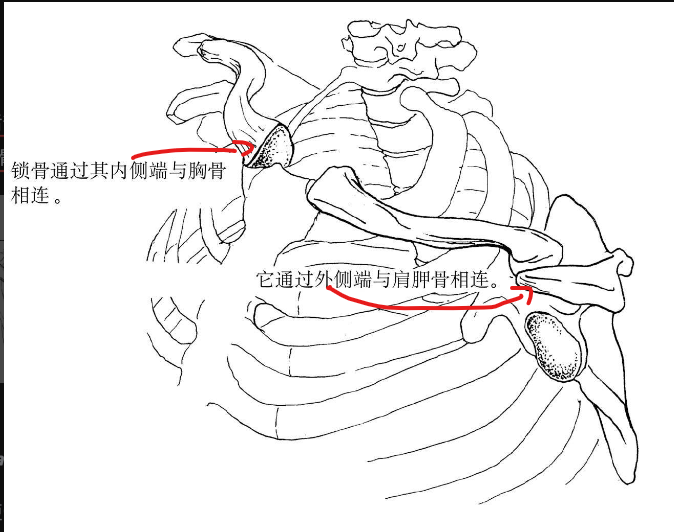

## 肩胛骨

> 前凹后凸

### 基本

肩胛骨为**三角形扁骨，有两面（前面和后面）、三个角以及三个缘。**

分别是上角下角外侧角，上缘内侧缘外侧缘

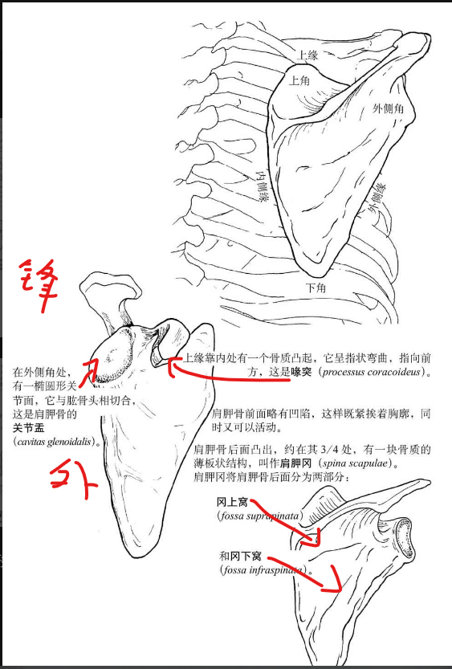

> **所以冈上肌在冈上窝上，冈下肌在冈下窝上**

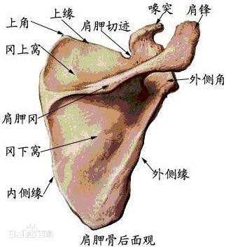

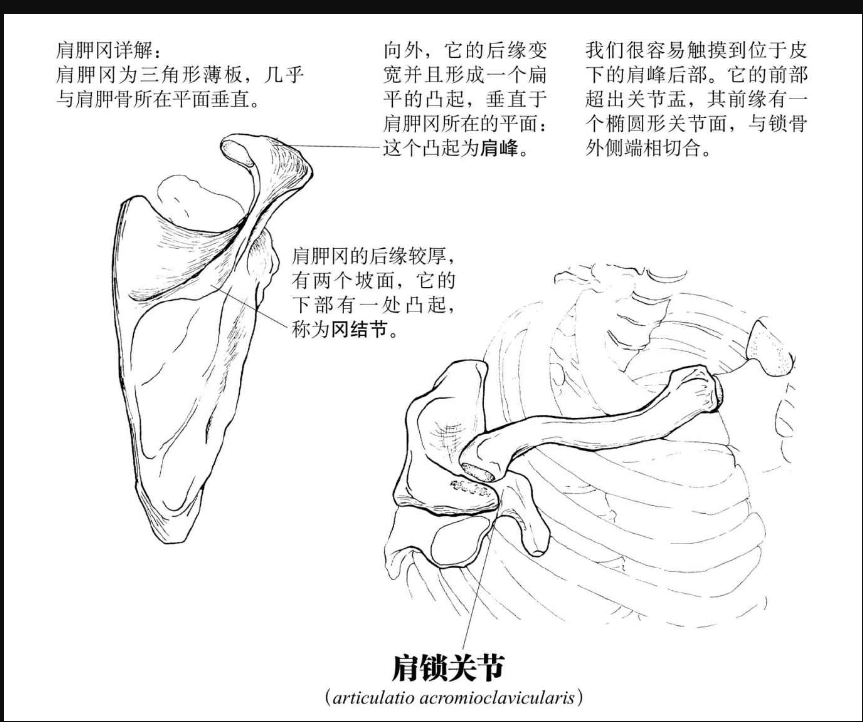

### 运动

包括：**上提下仰，外展内收**

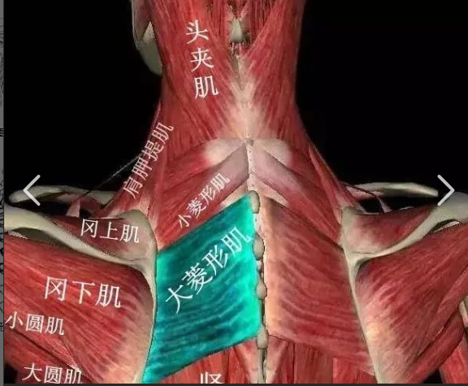

## 肱骨

肱骨位于上臂，为长骨，可分为一体二端。

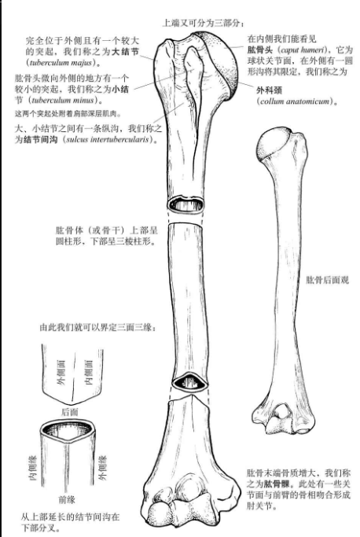

## 肩关节

**该关节运动性很强，但同时也很不稳定。**

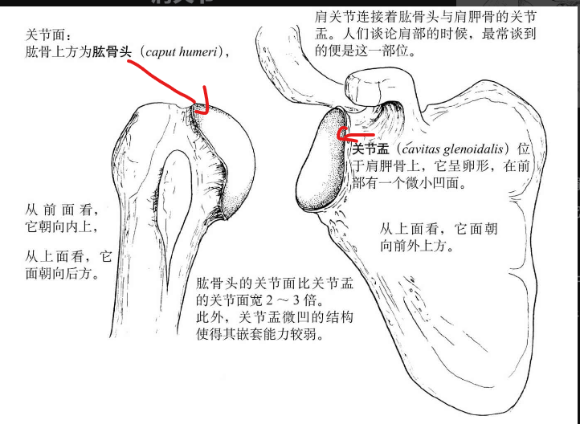

- **肩袖肌群**

  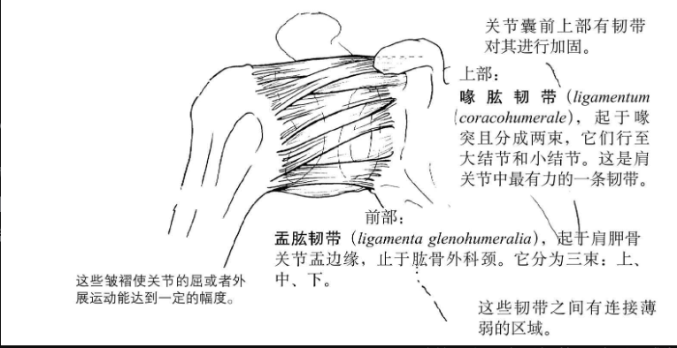

## 肩胸关节肌肉

### 前锯肌

前锯肌为宽大的扁肌，在胸廓一侧（上臂下方）。它起于肩胛骨深面（前面），沿其内侧缘走行。随即它缠绕到肋骨前外侧，由自身变宽而形成一些肌束，这些肌束附着于前10块肋骨上。

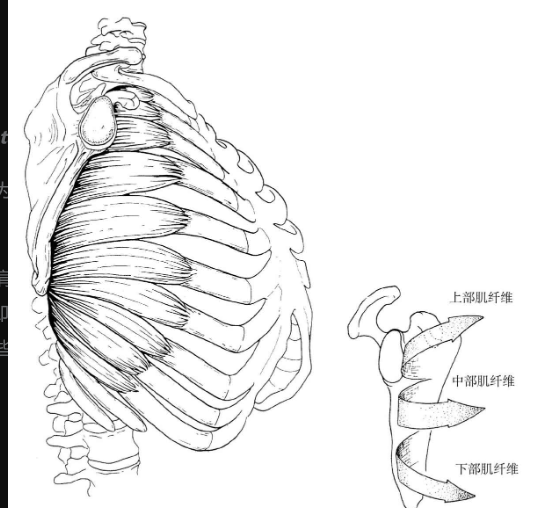

- **功能：**

若以肋为定点，它能**稳固肩胛骨紧贴于胸廓的内侧缘**。通过上部肌纤维将肩胛骨向外牵拉（外展）且使其**做外环转运动**。

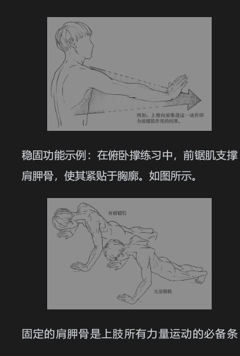

### 锁骨下肌

起于锁骨下面（中部），止于第1肋骨以及第1肋软骨上面。

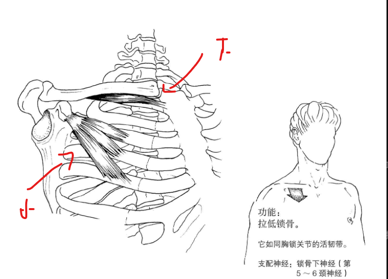

### 胸小肌

起于第3、4、5肋，它向上走行，止于喙突（水平部分）。

功能：

1. -若**以肋骨为定点，它可向前内下方牵拉喙突**，就**好像它试图在胸廓上方翻转肩胛骨；它意在拉大肩胛骨的内角；**
2. -若**定点是肩胛骨，它则能够提升肋骨；它是辅助吸气肌**。

### 胸锁乳突肌

若定点为颅骨，**它使锁骨内侧与胸骨上提，故为吸气肌。**

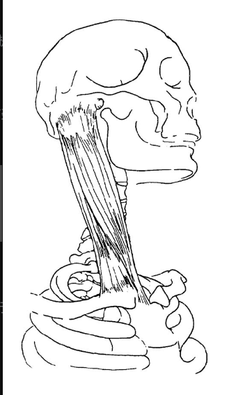

### 肩胛提肌

> 同时也要记肩胛下肌

起于肩胛骨上角，止于前四块颈椎的横突处。功能：

1. -若**定点为颈椎，它则提升肩胛骨，并使其旋内**；
2. -若定点为肩胛骨，参见第二章“躯干与颈后部的肌肉”。

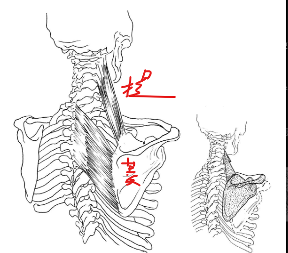

### 菱形肌

图片如上。

菱形肌为扁肌，位于脊柱与肩胛骨之间。它起于肩胛骨内侧缘，止于第7颈椎至第4胸椎之间的棘突。

功能：-若定点为脊柱，则使肩胛骨做内收与旋内运动；

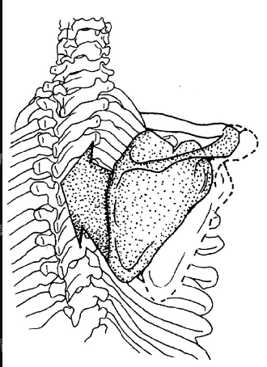

### 斜方肌

该肌肉形成宽阔的表层，它覆盖了位于颈后以及背部两肩胛骨之间的肌肉。斜方肌起于枕骨基底部，接下来是颈椎至第10胸椎的棘突。

功能：若以脊柱颈胸段为定点，这三个肌束具有内收功能，向背正中线方向牵拉肩胛骨（双肩靠拢）。

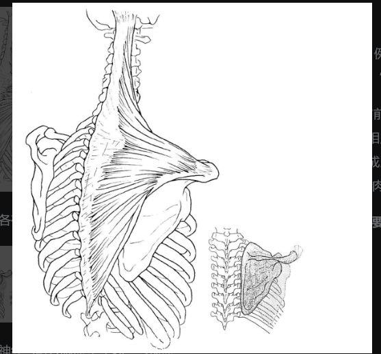

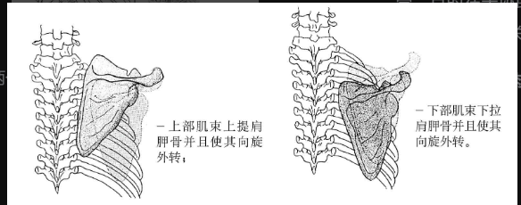

当**上肢悬空运动时（例如：敲打键盘的工作），上斜方肌通常有“过劳”现象。**中斜方肌（内收肌）与前锯肌（外展肌）配合工作。两者通过它们相反的运动来平衡肩胛骨，目的在于协助完成上肢所有的力量运动

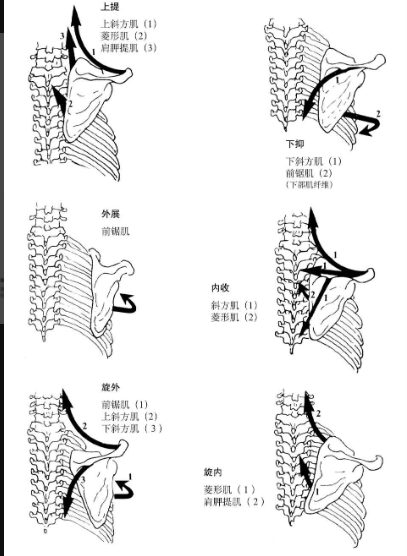

## 肩关节肌肉

### 肩胛下肌

> 同时也要记肩胛提肌

这部分肌肉**起于肩胛骨（从前面观察）深面（前面**）。它的肌纤维向肩胛骨外角集中，在此形成一块肌腱，止于肱骨上部的肱骨小结节。功能：它是主要的**上臂内回旋肌**。

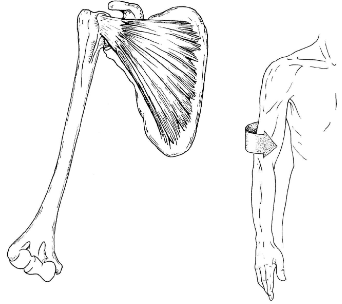

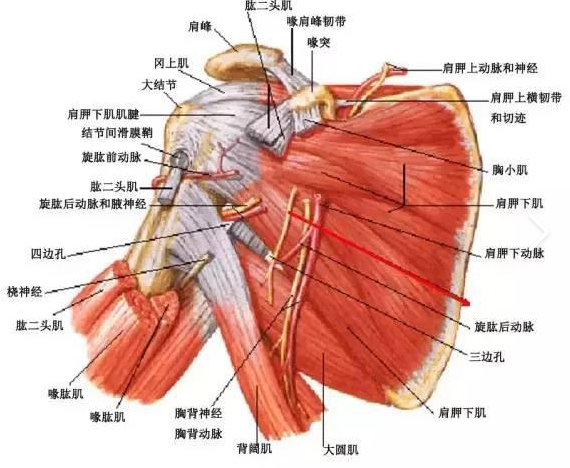

### 冈上肌

该肌肉起于冈上窝（肩胛骨后面）。它形成一块肌腱，穿过由肩峰、喙突以及韧带组成的穹形间隙内，然后止于肱骨大结节最高点。功能：它使上臂外展。其作用比较微弱，但是它与三角肌协同工作

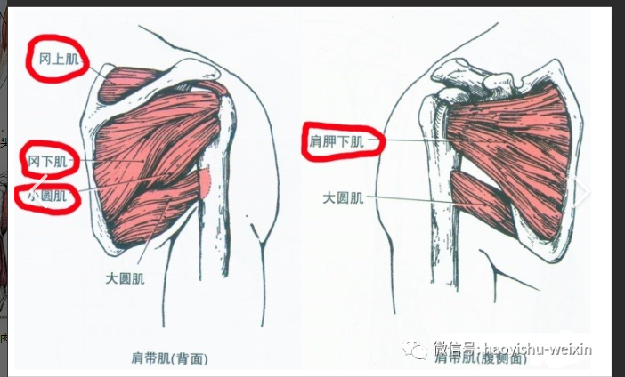

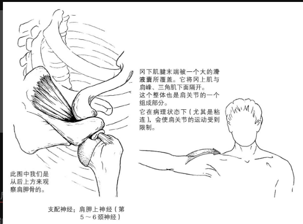

### 冈下肌

起于冈下窝内（其内2/3处）。它的肌腱经过肩关节囊，止于肱骨大结节、冈上肌后面。功能：冈下肌使肱骨旋外，并且少量地参与外展运动。

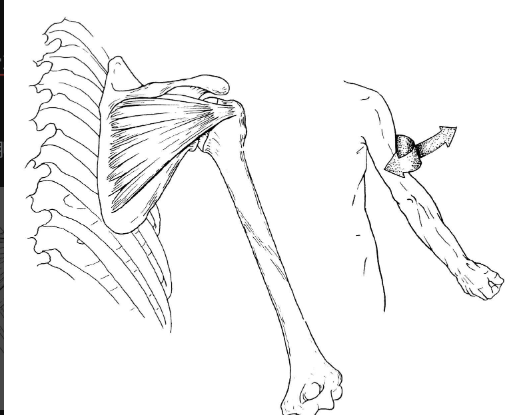

### 小圆肌

起于冈下窝，沿肩胛骨外侧缘跨过肩关节后方，止于肱骨大结节、冈下肌后面。功能：它使肱骨旋外。

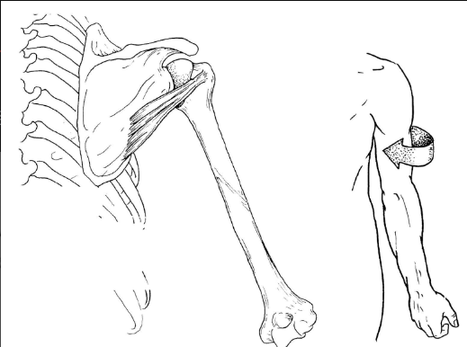

###  肩袖

**由肩胛下肌、冈上肌、冈下肌、小圆肌组成**，它们的肌腱附着于关节囊上。此外，它们的收缩能带动肱骨活动，是关节中重要的“活韧带”。

### 缘肱肌

起于喙突，止于肱骨内侧面（中部）。功能：使上臂屈或者内收。

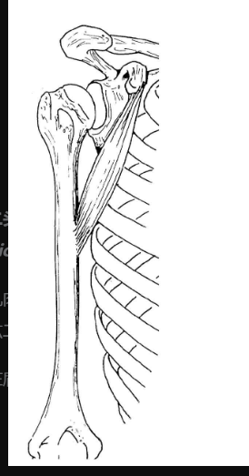

### 肱二头肌

它在肩部的功能：参与屈运动。

**短内长外**

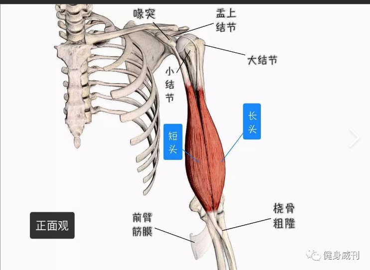

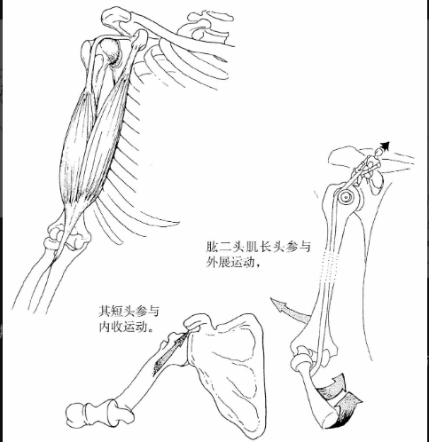

### 肱三头肌长头

它在肩部的功能：参与肩部内收。

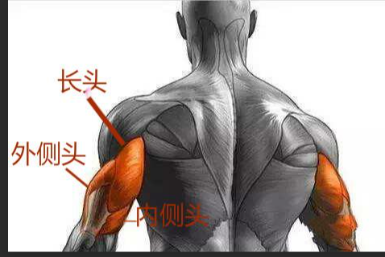

### 胸大肌

胸肌附着于锁骨（前缘内侧2/3处）、胸骨以及第1～6肋软骨与第7肋骨，之后肌纤维集中扭转形成肌腱，止于肱骨结节间沟外侧嵴。功能：-若定点为胸廓，这些肌纤维共同使上臂内收并且旋内。它收缩可以使上臂悬空。上部肌纤维做前屈运动，直至与胸大肌成60°夹角。

1. -若定点为肩：上部肌纤维拉低锁骨；下部肌纤维为吸气肌。
2. -若肩关节固定且伴随上臂前屈，所有的肌纤维均为吸气肌。

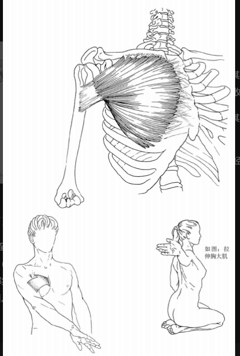

### 背阔肌

背阔肌起于第7胸椎至第5腰椎（棘突）、骶正中嵴以及最后四肋（外面）。它形成一个肌层，其肌纤维向肩部集中拧成一束，最后止于肱骨结节间沟内腱膜。

功能：

1. -若以肩部为动点（其余的附着点为定点），它可使上臂旋内、内收和后伸；
2. -若以肱骨为定点，其功能见第二章“躯干与颈后部的肌肉”。

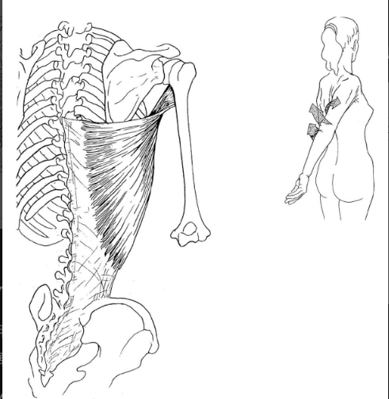

### 大圆机

大圆肌起于肩胛骨外侧缘（下部），向外上方走行，如同背阔肌一样，它止于结节间沟。大圆肌对上臂的功能与背阔肌相同，但它的功能相对要弱很多。

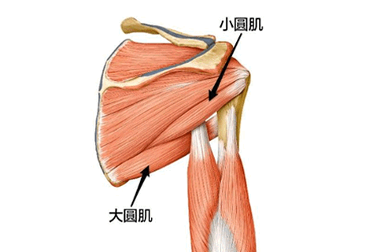

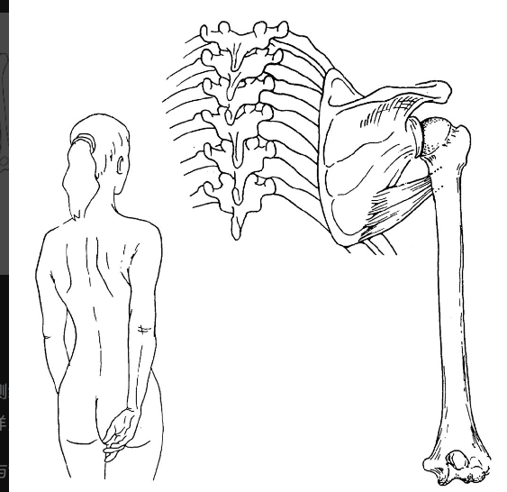
